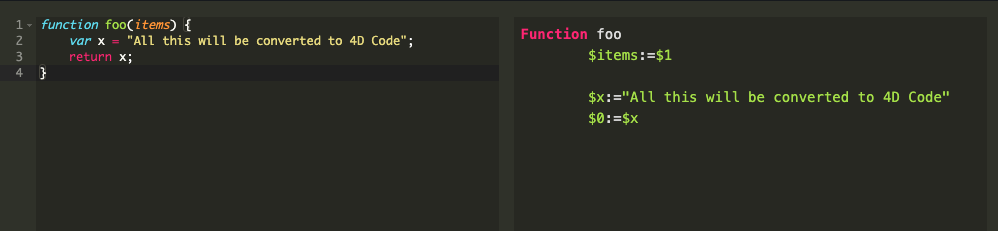

# Mesopotamia

[![language][code-shield]][code-url] [![language-top][code-top]][code-url] ![code-size][code-size] [![release][release-shield]][release-url] [![license][license-shield]][license-url] [![discord][discord-shield]][discord-url]
[](https://github.com/sponsors/phimage)
<a href="https://www.patreon.com/phimage">

</a>
<a href="https://paypal.me/ericphimage">

</a>

Convert Javascript to 4D code.

## WebServer

This component provide a web page to paste your javascript to convert.



> You could open this component and open the default URL [http://localhost:8119](http://localhost:8119) _(as defined by component [settings.4DSettings](Project/Sources/settings.4DSettings))_


## Example 

### javascript

```javascript
function nestTokens (tokens) {
    var nestedTokens = [6];
    var collector = nestedTokens;
    var sections = [];

    var token, section;
    for (var i = 0, numTokens = tokens.length; i < numTokens; ++i) {
      token = tokens[i];

      switch (token[0]) {
        case '#':
        case '^':
          collector.push(token);
          sections.push(token);
          collector = token[4] = [];
          break;
        case '/':
          section = sections.pop();
          section[5] = token[2];
          collector = sections.length > 0 ? sections[sections.length - 1][4] : nestedTokens;
          break;
        default:
          collector.push(token);
      }
    }
}
```

### 4D

```4d
Function nestTokens
	$tokens:=$1
	
	$nestedTokens:=New collection(6)
	$collector:=$nestedTokens
	$sections:=New collection()
	
	For ($i:=0$numTokens:=$tokens.length;$i<$numTokens;1)
		$token:=$tokens[$i]
		Case of 
			: ($token[0]="#")
				  // TODO merge with next case 
			: ($token[0]="^")
				$collector.push($token)
				$sections.push($token)
				$collector:=$token[4]:=New collection()
				  // break
			: ($token[0]="/")
				$section:=$sections.pop()
				$section[5]:=$token[2]
				$collector:=Choose($sections.length>0;$sections[sections.length-1][4];$nestedTokens)  // TODO heck that alternate path could be executed even if false, if not do a If Else
				  // break
			Else 
				$collector.push($token)
		End case 
		
	End for 
	
	$0:=$nestedTokens
```


## How it works?

The result of Javascript [Babel parser (previously Babylon)](https://babeljs.io/) compiler is decoded into 4D classes.

[](https://mesopelagique.github.io/Mesopotamia/Documentation/classDiagram.svg)

Then 4D code is generated from the created node tree.

## Acknowledgment

- Javascript editor by [Ace](https://ace.c9.io/)
- Javascript code parsing by [Babel parser (previously Babylon)](https://babeljs.io/) 
- Code syntax highlighting by [highlightjs](https://highlightjs.org/) with [4d addons](https://github.com/highlightjs/highlightjs-4d)

## TODO

- [ ] Support more JS code.
- [ ] Factorize code

---

[](https://mesopelagique.github.io/)

<!-- MARKDOWN LINKS & IMAGES -->
<!-- https://www.markdownguide.org/basic-syntax/#reference-style-links -->
[code-shield]: https://img.shields.io/static/v1?label=language&message=4d&color=blue
[code-top]: https://img.shields.io/github/languages/top/mesopelagique/Mesopotamia.svg
[code-size]: https://img.shields.io/github/languages/code-size/mesopelagique/Mesopotamia.svg
[code-url]: https://developer.4d.com/
[release-shield]: https://img.shields.io/github/v/release/mesopelagique/Mesopotamia
[release-url]: https://github.com/mesopelagique/Mesopotamia/releases/latest
[license-shield]: https://img.shields.io/github/license/mesopelagique/Mesopotamia
[license-url]: LICENSE.md
[discord-shield]: https://img.shields.io/badge/chat-discord-7289DA?logo=discord&style=flat
[discord-url]: https://discord.gg/dVTqZHr
